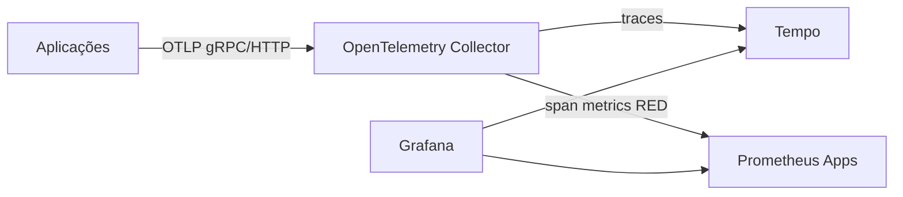

# opentelemetry-gitops

Red Hat build of OpenTelemetry para OpenShift Local. O Collector recebe OTLP
em `4317/4318`, limita memória, agrupa spans e envia traces ao
`TempoMonolithic`.

```bash
oc apply -k overlays/desenvolvimento
```

Aplicações devem exportar para:

```text
http://otel-collector-collector.observability.svc:4318
```

Referência: documentação Red Hat build of OpenTelemetry do OpenShift 4.20.


## Arquitetura



O Collector centraliza ingestão OTLP, aplica `memory_limiter` e `batch`, envia
traces ao Tempo e publica métricas RED via `span_metrics` para o Prometheus Apps
do repositório `prometheus-gitops`. No CRC validado, o Red Hat OpenTelemetry
Collector 0.152.1 suporta
`span_metrics`, mas não lista connector `servicegraph`; por isso o repositório
não tenta habilitar Service Graph no Collector. Essa parte deve ser feita com
Tempo metrics-generator, Grafana Alloy ou uma imagem de Collector que exponha o
connector apropriado.

Valide os componentes disponíveis no cluster com:

```bash
oc -n observability exec deploy/otel-collector-collector -- \
  /usr/bin/opentelemetry-collector components
```

## Monitoramento

O namespace `observability` recebe a label `observability=enabled` e o
`ServiceMonitor` do endpoint `spanmetrics` usa `monitoring.rhobs/v1` com label
`observability=platform`. Assim o Prometheus Apps coleta
`traces_span_metrics_*`. O User Workload Monitoring nativo do OpenShift não é
necessário para essa coleta.

## Ambientes e validação

```bash
oc kustomize overlays/desenvolvimento >/tmp/otel-dev.yaml
oc kustomize overlays/aceite >/tmp/otel-aceite.yaml
oc kustomize overlays/producao >/tmp/otel-prod.yaml
oc apply --dry-run=client -k overlays/desenvolvimento
```

O exporter Tempo aponta para
`tempo-tempo-monolithic-gateway.tempo.svc.cluster.local:4317`. Ajuste por
overlay se o namespace/nome do Tempo mudar. Mais detalhes em
`docs/AMBIENTES.md`.
